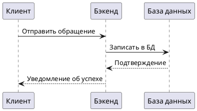

**Цель:** Описать пользователей и бизнес-процессы.
# Пользователи и бизнес-процессы

## 1. Пользователи
| Роль         | Описание                              |
|--------------|----------------------------------------|
| Клиент       | Отправляет обращения, видит статус     |
| Администратор| Управляет задачами, пользователями    |

## 2. Бизнес-процессы

### Процесс создания обращения
1. Клиент вводит данные (имя, email, описание).
2. Система сохраняет в базе данных.
3. Администратор получает уведомление.

### Процесс отслеживания статуса
1. Клиент запрашивает статус по ID обращения.
2. Система возвращает информацию из БД.

## 3. Диаграмма потока данных

```
